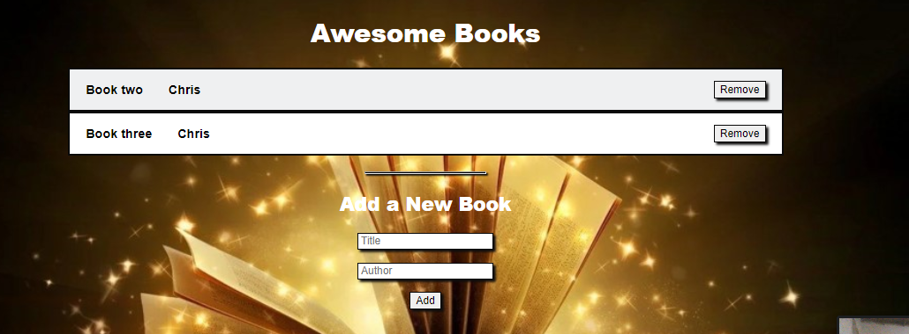

# Book-Store

> Awesome Books
> 

Things done so far in the project:

#### 1. Build desktop skeleton

- Parse a Figma design
- Use Flexbox and CSS Grid for positioning
- Use images and backgrounds

## Built With

- Major languages: HTML, CSS
- Technologies used: Lighthouse, Webhint, Stylelint

## Live Demo

[Live Demo Link](https://andrelau11.github.io/Book-Store/)

## Getting Started

To get a local copy up and running follow these simple example steps.

Use the following command in your terminal:

- **To clone the main project**

```
git clone git@github.com:AndreLau11/Book-Store.git
```

## Authors

👤 **Kait Cham**

- GitHub: [@kaitcham](https://github.com/kaitcham)
- Twitter: [@kaitcham](https://twitter.com/kaitcham)
- LinkedIn: [kaitcham](https://linkedin.com/in/kaitcham)

👤 **Hectot Andre Lau**

- GitHub: [@AndreLau11](https://github.com/AndreLau11)
- Twitter: [@HectorAndreLau](https://twitter.com/HectorAndreLau)
- LinkedIn: [@HectorAndreLauEstrada](https://www.linkedin.com/in/h%C3%A9ctor-andr%C3%A9-lau-estrada-b4947795/)
## 🤝 Contributing

Contributions, issues, and feature requests are welcome!

Feel free to check the [issues page](https://github.com/AndreLau11/Book-Store/issues).

## Show your support

Give a ⭐️ if you like this project!

## 📝 License

This project is [MIT](./MIT.md) licensed.